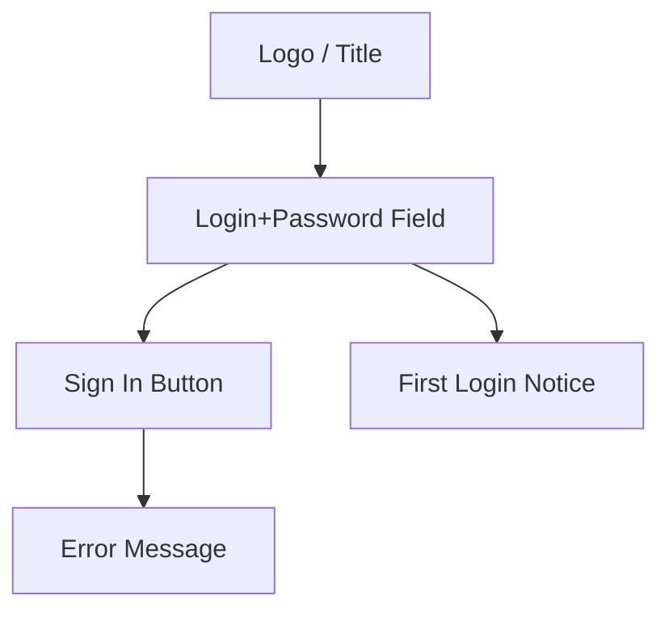
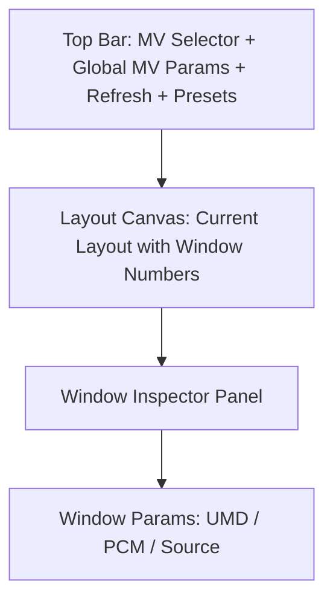
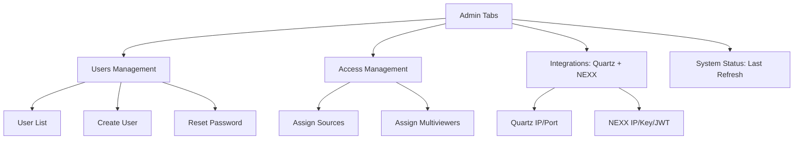
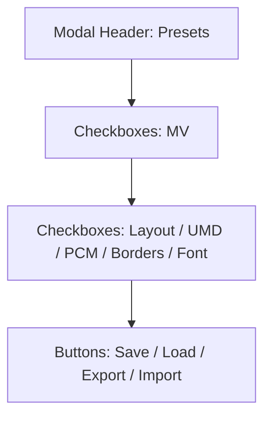
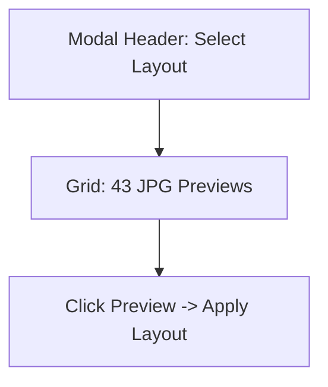

# Frontend Wireframes (Block Schemes)

## Login

```mermaid
flowchart TB
  A[Logo / Title] --> B[Login+Password Field]
  B --> D[Sign In Button]
  B --> E[First Login Notice]
  D --> F[Error Message]
```

## Main

```mermaid
flowchart TB
  H[Top Bar: MV Selector + Global MV Params + Refresh + Presets] --> L[Layout Canvas: Current Layout with Window Numbers]
  L --> W[Window Inspector Panel]
  W --> P[Window Params: UMD / PCM / Source]
```

## Admin

```mermaid
flowchart TB
  A[Admin Tabs] --> U[Users Management]
  A --> X[Access Management]
  A --> I[Integrations: Quartz + NEXX]
  A --> S[System Status: Last Refresh]

  U --> U1[User List]
  U --> U2[Create User]
  U --> U3[Reset Password]

  X --> X1[Assign Sources]
  X --> X2[Assign Multiviewers]

  I --> I1[Quartz IP/Port]
  I --> I2[NEXX IP/Key/JWT]
```

## Presets Modal

```mermaid
flowchart TB
  T[Modal Header: Presets] --> M[Checkboxes: MV]
  M --> C[Checkboxes: Layout / UMD / PCM / Borders / Font]
  C --> B[Buttons: Save / Load / Export / Import]
```

## Layout Preview Modal

```mermaid
flowchart TB
  H[Modal Header: Select Layout] --> G[Grid: 43 JPG Previews]
  G --> S[Click Preview -> Apply Layout]
```
